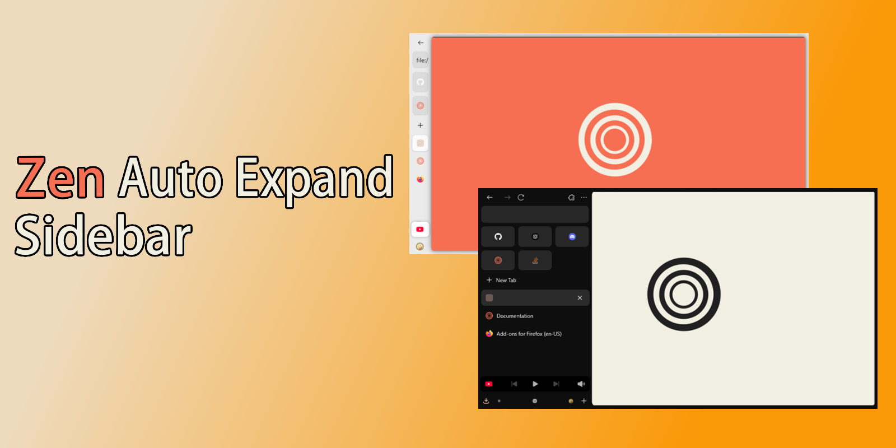

# Zen Auto Expand Sidebar

Zen mod to auto expand the sidebar on hover.

## How to install

- Get CosmoCreeper's [Sine](https://github.com/CosmoCreeper/Sine)
- Search for the mod and install it (or add the URL)
- **IMPORTANT**: You may need to close and Reopen zen for the mod to properly apply
- **IMPORTANT**: Use the mod in single toolbar or multiple toolbars mode, never on collapsed toolbar mode
- **IMPORTANT**: You may not use compact mode, unless  the "hide toolbar" option is the only one selected

### Usage Details
- If the tab bar ever gets stuck in the open position, right click anywhere on the tab bar to open a popup menu, and click anywhere else to close it.
- If the above fails, drag and relase a tab.

## Custimization Options
In the mods menu, clicking on the gear icon will give you several customization options:
- Fade unloaded (sleeping) tabs
- Control Collapsed and expanded widths
- Control the delay to expand and animation Speeds
- Hide or show the workspace indicator
- Show the tabs scroll bar in the collapsed state
- Automatically reorder Essential tabs to keep displaying of the active tab

